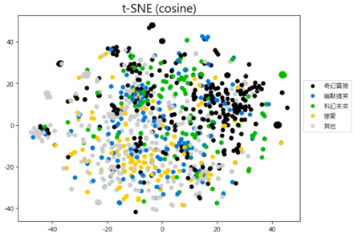
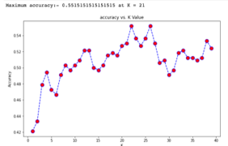

## Text Mining 2021 Final Project: 日本動漫分析與輪廓孵化器 ##

We seek to gain insight of the plots and character descriptions from Anime(動漫), to understand the relastionships between these animation pieces.

### Data ###
* Resource: 巴哈姆特、Wikipedia
* Preprocessing: Token via TCkipTagger, build TF-IDF vectors for all paragraphs
* Filter Stop Words: 哈爾濱工業大學停用詞表 1893個中文與非中文字
* 13 classes in raw data but high class imbalance. To simplfiy the task, 5 class with the most data were kept in 'bg_class5.txt' for further training

### Result ###

We tried models including simple RNN, LSTM, SVM and kNN, but got really poor Accuracy :((

So we took a different approach, using PCA to see the possibilty to seperate these data by class in a vector space.

From PCA results and kNN testing on different k value, we conclude that it seems hard to classify the anime only through the data we use, or perhaps deeper and bigger model would help.

